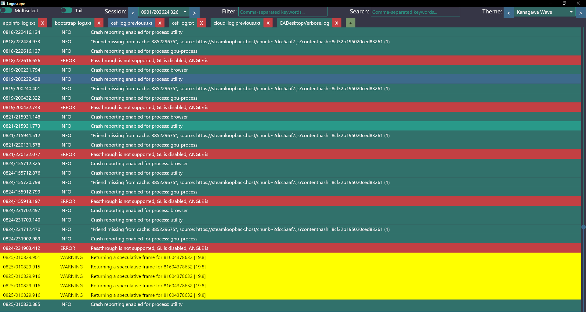
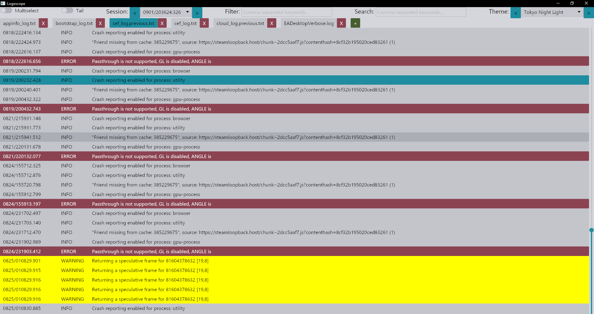
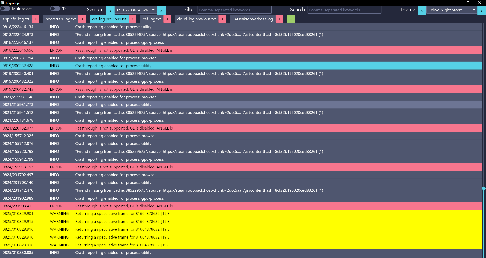
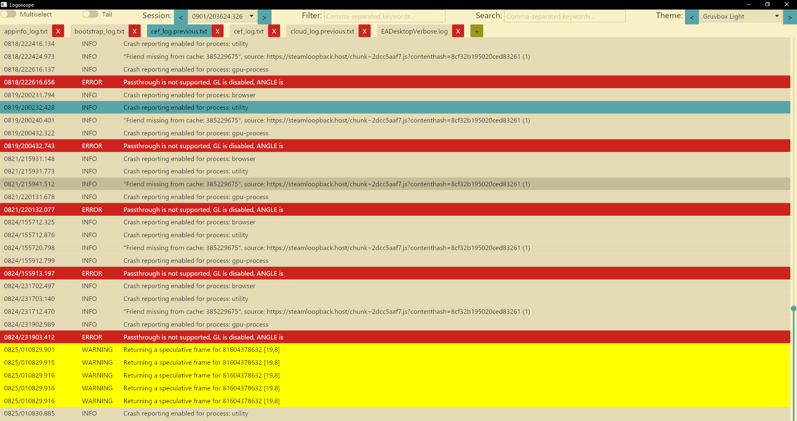

 

# Logoscope

Log viewer  

<table>
  <tr>
    <td>
      
    </td>
    <td>
      
    </td>
  </tr>
  <tr>
    <td>
      
    </td>
    <td>
      
    </td>
  </tr>
</table>

[Download](https://bazizi.github.io/logoscope/)

## Features
* Breaking log files into multiple sessions
* Filtering log entires by multiple comma-separated keywords
* Searching log entries by multiple comma-separated keywords
* Viewing entries combined from opened log files ordered by log date
* Ability to tail log files in real time
